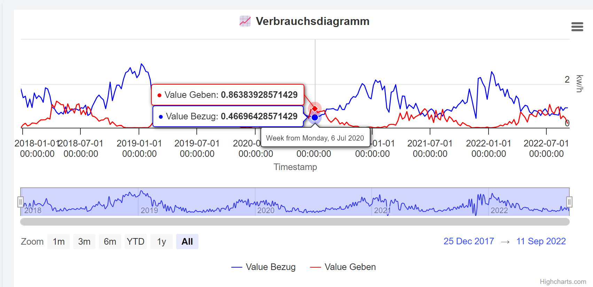

# M306 Projekt

Dies ist die Lösung des Teams **Marco, Lucas, Ben, Lambo und Sami**,
für das Modul 306. Das Projekt ist eine Webapplikation, welche die
Funktionen des Datenvisualisieren und der Energieverwendung kombiniert.

## Inhaltsverzeichnis

- [M306 Projekt](#m306-projekt)
  - [Inhaltsverzeichnis](#inhaltsverzeichnis)
  - [Installation](#installation)
  - [Verwendung](#verwendung)
  - [Team](#team)


## Installation

So installieren Sie das Projekt, und lassen es lokal auf Ihrem PC laufen.

1. Projekt von GitHub klonen
    ```sh
    git clone https://github.com/BWizard06/M306_flask_backend.git -b main
    ```

2. In das Projektverzeichnis wechseln
    ```sh
    cd M306_flask_backend
    ```

3. Python Module installieren
    ```sh
    pip install -r requirements.txt
    ```

4. Flask App starten
    ```sh
    python main.py
    ```

5. Im Browser die URL `http://localhost:5000` aufrufen
6. Fertig!

## Verwendung

So verwenden Sie das Projekt.

1. Im Browser die URL `http://localhost:5000` aufrufen

2. Auswählen, welches Diagramm Sie plotten möchten:
   1. Verbrauchsdiagramm
   2. Zählerstanddiagramm

3. Die Daten auswählen, welche Sie plotten möchten, indem SIe zugehörige
   ZIP-Files hochladen.


4. Auf `Process XML Files` klicken, um die Daten zu verarbeiten.



## Team

Dieses Projekt wurde von den folgenden Personen erstellt:

- [Sami Hindi](https://www.samihindi.com)
- [Marco Spina](https://github.com/MarcoSpinabzz)
- [Lucas Blom](https://github.com/LucasBlom)
- [Lambotharan Logendran](https://github.com/lambooo1)
- [Ben Brändle](https://github.com/BWizard06)

Danke!